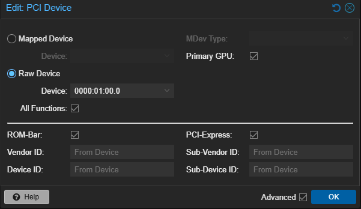
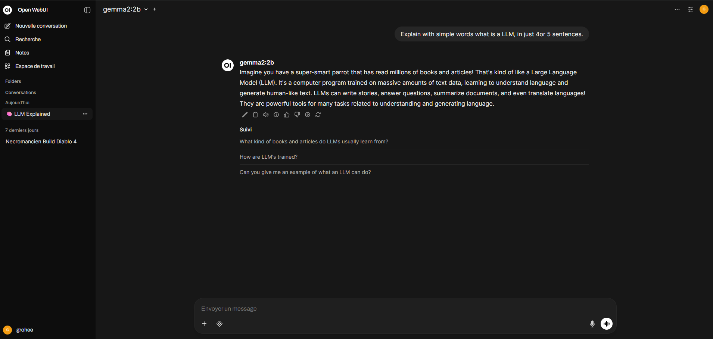

Un LLM (Large Language Model) est un modèle d’intelligence artificielle (IA) entraîné sur de très grandes quantités de données, ce qui lui permet de comprendre et de générer du langage naturel. Concrètement, il peut résumer des documents, répondre à des questions variées, générer du code, ou agir sous forme d’agent en étant interfacé avec d’autres outils (terminal, navigateur ou des APIs).

Sans aborder précisément les aspects techniques, ces modèles fonctionnent en prédisant le mot suivant dans une phrase, en se basant sur le contexte des mots précédents. Le contexte des mots est représenté par un très grand nombre de paramètres aussi appelés **poids** (weights). Par exemple, GPT-3 de OpenAI possède 175 milliards de paramètres. Plus un modèle a de paramètres, plus il est performant dans la compréhension et la génération de texte. Il est ainsi capable de saisir une plus grande variété de contextes et de nuances dans le langage.

Bien que les LLMs nécessitent un volume de calcul important lors de leur entraînement, leur exécution nécessite bien moins de ressources. En effet, il est possible d'exécuter des modèles plus petits et optimisés sur du matériel grand public, notamment des cartes graphiques (GPU) telles que celles de NVIDIA ou AMD. Evidemment, pour exécuter les modèles les plus gourmands, il faut opter pour des GPU modernes et puissants, mais de nombreux modèles plus légers sont disponibles et peuvent fonctionner sur des cartes graphiques plus anciennes.

## Un LLM dans un homelab pour quels usages ?

Exécuter un **LLM** localement dans son homelab présente des avantages à plusieurs égards.

### Vie privée et sécurité

Le premier avantage évident concerne la préservation de la vie privée. En hébergeant une IA localement, les données de l'utilisateur ne sont ni envoyées ni stockées à l'extérieur, ce qui réduit les risques de fuite de données sensibles, de surveillance ou d'usage commercial non désiré. Ces outils prenant en effet une place de plus en plus importante dans notre quotidien, il peut arriver que des informations confidentielles soient partagées avec ces services. 

### Personnalisation et efficacité

Un LLM local peut être personnalisé pour répondre à des besoins spécifiques. Sans entrer immédiatement dans les détails techniques, il est possible d'effectuer un **fine-tuning** du modèle en utilisant des données spécifiques à un contexte (documentation d'entreprise, FAQ, etc.), ce qui permet d'améliorer la pertinence des réponses fournies par l'IA. De nouvelles technologies appelées **RAG (Retrieval-Augmented Generation)** permettent aussi de combiner un LLM avec une base de connaissances locale, pour des réponses encore plus précises.

### Coût

Les coûts associés aux outils **IA** peuvent rapidement devenir importants : *ChatGPT* et *Claude* coûtent 24€ par mois, *Gemini Pro* est à 21€ par mois, et le plan *Pro* de *Mistral* est affiché à 17,99€ par mois. Ces tarifs, bien qu'attractifs, peuvent s'additionner rapidement si l'on souhaite bénéficier de plusieurs services en fonction des besoins : *GPT* pour la génération de texte et *Claude* pour la génération de code. L'avantage d'un LLM local est qu'il n'y a pas de coût récurrent, si ce n'est l'électricité consommée par le serveur et le coût initial du matériel. 

### Expérimentation et liberté

Comme mentionné précédemment, chaque **LLM** a ses forces et ses faiblesses. *GPT* est très performant pour générer du texte et *Claude* excelle dans la génération de code. En déployant une infrastructure permettant d'héberger un modèle, on va pouvoir tester différents modèles, les comparer, et choisir celui qui convient le mieux à chaque tâche. L'utilisateur bénéficie même d'un choix plus large puisqu'il n'est pas limité aux modèles proposés par les grandes entreprises. Il peut ainsi explorer des modèles open-source, parfois plus légers et adaptés à des usages spécifique ou du matériel plus ancien.

### Bénéficier de la puissance de l’IA

Utiliser l'IA dans un homelab peut débloquer de nouveaux horizons d'automatisation et d'efficacité. Couplé à des outils comme *n8n*, *Node-RED*, ou des scripts personnalisés, un LLM peut permettre un traitement automatisé de tâches complexes, analyser des logs, fournir des rapports, envoyer des notifications personnalisées, effectuer de l'autoremediation, et bien plus encore. De plus, c'est un moyen intelligent d'explorer le mode de **l'AIOps**, c'est à dire l'IA appliqué au domaine des opérations IT (administration système, réseau, sécurité, etc.).

**Remarque** : il est important de ne pas utiliser d'agent IA pouvant faire tout et n'importe quoi sur des serveurs. En effet, un agent mal configuré pourrait supprimer des fichiers importants, modifier des configurations, ou causer des interruptions de service. Il est donc crucial de définir des limites strictes et de surveiller les actions entreprises par l'agent. Cela peut être fait, par exemple, en créant un utilisateur dédié pour l'agent avec des permissions limitées sur les fichierrs et les commandes qu'il peut exécuter (via les `sudoers`).

## Mettre en place un LLM dans son homelab

L'objet de ce guide est de détailler pas à pas l'installation d'un **LLM** sur une machine virtuelle (VM) *Debian* utilisant une carte graphique *NVIDIA* dans *Proxmox*. Le modèle fonctionnera avec *Ollama*, et une interface graphique sera fournie par **OpenWebUI**, tout deux fonctionnant en tant que conteneurs *Docker*.

*Ollama* est une plateforme qui facilite la gestion et l'exécution de modèles de langage localement. Elle offre une API pour interagir avec les modèles, ainsi qu'une large bibliothèque de modèles pré-entraînés, dont un grand nombre sont open-source. Des modèles pour diverses applications sont disponibles : génération de texte, d'images, de code, etc. 

**Prérequis** :

- Un serveur hébergeant l'hyperviseur *Proxmox VE*
- Une carte graphique compatible *NVIDIA* (comme une *GTX 970*)
- Une image ISO de la distribution de votre choix (Debian 13 dans cet exemple)

**Remarque** : les commandes à exécuter 

### Création d'une VM Proxmox avec GPU Passthrough

Le **PCI Passthrough** permet à un server virtuel d'accéder directement à un périphérique PCI, dans notre cas il s'agit d'une carte graphique physique connectée physiquement à l'hyperviseur. Les modèles de langage nécessitant de grandes puissances de calculs pour fonctionner efficacement, même pour de la simple inférence, un GPU est donc indispensable pour assurer un fonctionnement optimal de ces outils. On peut évidemment faire du **passthrough** dans d'autres cas : carte réseau, carte graphique pour du jeu, de la 3D ou de la conversion vidéo (pour un serveur *Plex* ou *Jellyfin* par exemple).

Cette première étape nécessite des configuration *Proxmox* avancées, qui sont heureusement détaillées dans une [section déidée de la documentation](https://pve.proxmox.com/wiki/PCI_Passthrough) de l'hyperviseur.

#### Vérifier que la fonctionnalité d'IOMMU est activée

**IOMMU** (Input-Output Memory Management Unit) est une technologie qui permet de gérer la mémoire entre les périphériques et le système. Elle est indispensable au fonctionnement du **PCI Passthrough** car elle permet d'isoler les périphériques PCI, assurant donc que chaque VM puisse accéder directement au matériel qui lui est assigné, sans que d'autres VM ou l'hôte n'interfèrent. Pour aller un peu plus loin, chaque périphérique se voit attribuer un **groupe IOMMU**.

Pour vérifier que cette fonctionnalité est bien activée, il faut exécuter la commande suivante en tant que **root** dans le shell de *Proxmox* :

```bash
dmesg | grep -e DMAR -e IOMMU
```

Une ligne `DMAR: IOMMU enabled` devrait apparaître. Si ce n'est pas le cas, il faut activer l'IOMMU dans le BIOS de la machine hôte, puis ajouter les options suivantes au fichier `/etc/default/grub` :

```bash
GRUB_CMDLINE_LINUX_DEFAULT="quiet intel_iommu=on iommu=pt" # Intel
GRUB_CMDLINE_LINUX_DEFAULT="quiet amd_iommu=on iommu=pt" # AMD
```

Une fois ces lignes ajoutées, il faut exécuter la commande `update-grub2` et redémarrer le serveur pour que les modifications soient prises en compte.

Ensuite, il faut vérifier que le **remapping des interruptions IOMMU** est bien activé :

```bash
dmesg | grep 'remapping'
```

Le résultat attendu est :

```bash
AMD-Vi: Interrupt remapping enabled
DMAR-IR: Enabled IRQ remapping in x2apic mode
```

Si ce n'est pas le cas, il faudra ajouter la ligne suivante dans un fichier `/etc/modprobe.d/iommu_unsafe_interrupts.conf` :

```bash
options vfio_iommu_type1 allow_unsafe_interrupts=1
```

Enfin, il faut vérifier l'isolation IOMMU des périphériques PCI en listant les groupes IOMMU avec `pvesh get /nodes/{nodename}/hardware/pci --pci-class-blacklist ""`. Le résultat de cette commande est un tableau listant les périphériques PCI et leurs groupes IOMMU. Chaque groupe doit contenir un seul périphérique pour assurer un isolement correct.

Si la commande ne fonctionne pas, il est possible que l'option **ACS (Access Control Services)** ne soit pas activée dans le BIOS. Cependant, si l'option n'est pas disponible, il faudra passer par l'utilisation du [patch ACS de Alex Williamson](https://lkml.org/lkml/2013/5/30/513). Le guide n'aborde pas cette étape puisqu'elle est optionnelle et dépend du matériel utilisé.

#### Configurer les modules VFIO

**VFIO (Virtual Function I/O)** est un framework du noyau Linux qui permet aux utilisateurs d'accéder directement aux périphériques matériels depuis des environnements virtualisés. Il est utilisé pour le **PCI Passthrough** car il permet de sécuriser l'accès aux périphériques en isolant les ressources matérielles, garantissant ainsi que chaque VM puisse utiliser le matériel qui lui est assigné sans interférence.

Plusieurs modules doivent être ajoutés au noyau pour pouvoir faire du **PCI Passthrough**. Pour cela, il faut ajouer les lignes suivantes dans le fichier `/etc/modules` :

```bash
vfio
vfio_iommu_type1
vfio_pci
vfio_virqfd
```

Pour appliquer ces modifications, il faut exécuter la commande `update-initramfs` et redémarrer le serveur.

#### Empêcher l'hyperviseur d'utiliser le GPU

Enfin, il faut empêcher l'hôte d'utiliser le GPU puisqu'il sera utilisé par une VM. Pour cela, il faut exclure les pilotes du GPU en ajoutant des exclusions dans un fichier `/etc/modprobe.d/blacklist.conf` :

- **Pour des GPU Nvidia** :

```bash
blacklist nouveau
blacklist nvidia 
```

- **Pour des GPU AMD** :

```bash
blacklist amdgpu
blacklist radeon
```

- **Pour des GPU Intel** :

```bash
blacklist i915
```

Il est nécessaire de redémarrer le serveur pour appliquer ces modifications.

#### Créer la VM avec le GPU passthrough

Une fois les préconfigurations effectuées, il est temps de créer la VM qui accueillera le **LLM**. 

Dans l'interface web de *Proxmox*, il faut créer une nouvelle VM qui aura la configuration suivante :

- **Type de machine** : `q35`
- **BIOS** : `OVMF (UEFI)`
- **Affichage** : `VirtIO-GPU`

Une fois la VM créée, il faut ajouter un périphérique PCI dans l'onglet `Hardware` de la VM. La configuration doit être la suivante :



Le reste de la configuration de la VM est à faire directement dans l'OS invité. Dans ce guide, on utilise *Debian 13* mais d'autres distributions prennent en charge les GPU *NVIDIA* comme *Ubuntu* ou *Fedora*.

#### Configurer les drivers NVIDIA dans la VM

L'ensemble de la procédure d'installation des drivers *NVIDIA* sur *Debian* est détaillée dans la [documentation officielle de Debian](https://wiki.debian.org/NvidiaGraphicsDrivers). Cette procédure est essentielle afin que la VM puisse utiliser le GPU.

Tout d'abord, avant d'installer les drivers, il faut ajouter les dépôts `contrib`, `non-free-firmware` et `non-free` dans le fichier `/etc/apt/sources.list` afin de pouvoir télécharger les paquets nécessaires :

```bash
deb http://deb.debian.org/debian/ trixie main non-free-firmware non-free contrib
deb-src http://deb.debian.org/debian/ trixie main non-free-firmware non-free contrib

deb http://security.debian.org/debian-security trixie-security main non-free-firmware non-free contrib
deb-src http://security.debian.org/debian-security trixie-security main non-free-firmware non-free contrib


deb http://deb.debian.org/debian/ trixie-updates main non-free-firmware non-free contrib
deb-src http://deb.debian.org/debian/ trixie-updates main non-free-firmware non-free contrib
```

Par défaut, les dépôts `contrib` et `non-free` ne sont pas activés dans *Debian*. Ainsi, si on tente d'installer les drivers *NVIDIA* avec `apt`, le gestionnaire de paquets ne trouvera pas les drivers cherchés.

Avant d'installer les drivers, il faut aussi installer le paquet `linux-headers`. Pour cela, il faut exécuter la commande suivante :

```bash
apt install linux-headers-amd64 # Choisir en fonction de l'architecture (amd64, arm64...)
```

Lorsque les dépôts sont ajoutés, il faut mettre à jour la liste des paquets avec `apt update` puis installer l'utilitaire `nvidia-detect` qui va permettre de détecter la carte graphique et recommander les drivers appropriés :

```bash
apt install nvidia-detect
nvidia-detect
```

Cet utilitaire évite d'avoir à chercher manuellement quel driver est compatible avec la carte graphique.

Avant l'installation, il faut ajouter une exclusion pour le driver `nouveau` dans un fichier `/etc/modprobe.d/blacklist-nouveau.conf` :

```bash
blacklist nouveau
options nouveau modeset=0
```

Cette exclusion est importante car il ne faut pas que le driver libre `nouveau` soit chargé en même temps que les drivers propriétaires *NVIDIA*, au risque de provoquer des conflits.

Il reste enfin à installer les drivers recommandés par `nvidia-detect` :

```bash
apt install nvidia-kernel-dkms nvidia-driver firmware-misc-nonfree 
```

Il reste alors à redémarrer le serveur puis vérifier l'installation avec la commande `nvidia-smi` ou `dkms status` :

```bash
nvidia-smi
dkms status
```

Si la sortie de `nvidia-smi` affiche un tableau avec les informations de la carte graphique, c'est que les drivers sont correctement installés et que le GPU peut être utilisé par la VM. Bravo !

En cas d'échec de `nvidia-smi`, il est possible que le **Secure Boot** soit activé dans le BIOS de la machine hôte. Dans ce cas, il faut le désactiver. Il peut aussi être intéressant de vérifier que le driver `nouveau` n'est pas installé avec la commande `lsmod | grep nouveau`. Si c'est le cas, il faut supprimer les paquets associés à ce driver.

### Installer le NVIDIA Container Toolkit

Puisque l'on souhaite utiliser *ollama* dans un conteneur *Docker*, il est nécessaire d'installer le **NVIDIA Container Toolkit** qui permet aux conteneurs d'utiliser le GPU.

La procédure abordée ici est issue de la [documentation officielle de NVIDIA](https://docs.nvidia.com/datacenter/cloud-native/container-toolkit/latest/install-guide.html).

Dans un premier temps, il faut ajouter les dépôts du **NVIDIA Container Toolkit** :

```bash
curl -fsSL https://nvidia.github.io/libnvidia-container/gpgkey | sudo gpg --dearmor -o /usr/share/keyrings/nvidia-container-toolkit-keyring.gpg \
  && curl -s -L https://nvidia.github.io/libnvidia-container/stable/deb/nvidia-container-toolkit.list | \
    sed 's#deb https://#deb [signed-by=/usr/share/keyrings/nvidia-container-toolkit-keyring.gpg] https://#g' | \
    sudo tee /etc/apt/sources.list.d/nvidia-container-toolkit.list
```

Une fois ajoutés, il faut mettre à jour la liste des paquets avec `sudo apt update` puis installer le **NVIDIA Container Toolkit** :

```bash
export NVIDIA_CONTAINER_TOOLKIT_VERSION=1.17.8-1
sudo apt install -y \
  nvidia-container-toolkit=${NVIDIA_CONTAINER_TOOLKIT_VERSION} \
  nvidia-container-toolkit-base=${NVIDIA_CONTAINER_TOOLKIT_VERSION} \
  libnvidia-container-tools=${NVIDIA_CONTAINER_TOOLKIT_VERSION} \
  libnvidia-container1=${NVIDIA_CONTAINER_TOOLKIT_VERSION}
```

Configurer le runtime et redémarrer Docker :

```bash
sudo nvidia-ctk runtime configure --runtime=docker
sudo systemctl restart docker
```

Enfin, on peut tester que le GPU est bien accessible depuis un conteneur *Docker* :

```bash
sudo docker run --rm --runtime=nvidia --gpus all ubuntu nvidia-smi
```

Si la sortie de la commande affiche un tableau avec les informations de la carte graphique, cela signifie que le **NVIDIA Container Toolkit** est correctement installé et que les conteneurs *Docker* peuvent utiliser le GPU. *Ollama* pourra dès lors bénéficier de l'accélération matérielle apportée par la carte afin d'exécuter les modèles importés.

### Optionnel : corriger l’erreur `Auto-detected mode as 'legacy'` en créant une configuration CDI

Si, lors de l'exécution du conteneur, l'erreur suivante apparaît, des manipulations supplémentaires sont nécessaires :

```
docker: Error response from daemon: failed to create task for container: failed to create shim task: OCI runtime create failed: runc create failed: unable to start container process: error during container init: error running prestart hook #0: exit status 1, stdout: , stderr: Auto-detected mode as 'legacy'
```

Pour cela, il faut générer une configuration **CDI (Container Device Interface)**. Cette configuration permet de définir comment les périphériques matériels, comme les GPU, sont exposés aux conteneurs. *NVIDIA* détaille cette procédure dans une [section dédiée de sa documentation](https://docs.nvidia.com/datacenter/cloud-native/container-toolkit/latest/cdi-support.html).

Dans un premier temps, il faut vérifier que les lignes suivantes apparaissent dans le fichier `/etc/nvidia-container-runtime/config.toml` :

```toml
[nvidia-container-runtime-hook]
path = "nvidia-container-runtime-hook"
skip-mode-detection = true

[nvidia-container-runtime]
log-level = "info"
mode = "cdi"
runtimes = ["docker-runc", "runc", "crun"]

[nvidia-container-runtime.modes.cdi]
annotation-prefixes = ["cdi.k8s.io/"]
default-kind = "nvidia.com/gpu"
spec-dirs = ["/etc/cdi", "/var/run/cdi"]
```

Si certaines lignes diffèrent, il faut les modifier en conséquence.

Une fois cette modification effectuée, il faut redémarrer le service *Docker* avec `systemctl restart docker` puis relancer le conteneur. Cette étape terminée, il faut désormais créer une configuration **CDI**.

Pour cela, il faut éxécuter les commandes suivantes :

```bash
nvidia-ctk cdi generate --output=/etc/cdi/cdi.yaml
systemctl restart docker
```

Afin de vérifier que la configuration a bien été générée, on peut utiliser la commande `nvidia-ctk cdi list --load-specs`.

La configuration générée doit faire apparaître les périphériques disponibles, par exemple :

```yaml
...
devices:
- containerEdits:
    deviceNodes:
    - path: /dev/nvidia0
  name: "0"
- containerEdits:
    deviceNodes:
    - path: /dev/nvidia0
  name: GPU-98d95580-75e3-336a-bc9a-5300642039d9
- containerEdits:
    deviceNodes:
    - path: /dev/nvidia0
  name: all
kind: nvidia.com/gpu
```

Ici, on voit que le périphérique `/dev/nvidia0` est bien exposé dans le conteneur sous trois formes différentes : par son index `0`, par son UUID `GPU-xxxx`, et sous le nom générique `all`.

Dès lors, on peut tester l'accès au GPU depuis un conteneur *Docker* avec la commande suivante :

```bash
docker run --rm --device 'nvidia.com/gpu=0' nvidia/cuda:12.4.1-base-ubuntu22.04 nvidia-smi
```

Dans mon cas, j'ai été contraint d'effectuer ces manipulations car ma carte graphique *GTX 970* n'est pas de première jeunesse. Sur une carte plus récente, il est possible que cette étape ne soit pas nécessaire.

Désormais, la connexion entre le conteneur *Docker* et le GPU est fonctionnelle. *Ollama* peut être installé.

### Déployer Ollama et OpenWebUI avec Docker Compose

Pour installer *Ollama* et *OpenWebUI*, il faut d'abord installer *Docker* et *Docker Compose* dans la VM. L'installation des outils est détaillée dans leurs documentations respectives :

- [Documentation officielle de Docker](https://docs.docker.com/engine/install/debian/)
- [Documentation officielle de Docker Compose](https://docs.docker.com/compose/install/)

Le fichier `docker compose` suivant permet de déployer *Ollama* et *OpenWebUI* très facilement :

```yaml
services:
  ollama:
    image: ollama/ollama:latest
    container_name: ollama
    ports:
      - "11434:11434"
    volumes:
      - ollama:/root/.ollama
    environment:
      - OLLAMA_HOST=0.0.0.0
      - OLLAMA_NUM_GPU=1
    devices:
      - "nvidia.com/gpu=0"
    restart: unless-stopped

  openwebui:
    image: ghcr.io/open-webui/open-webui
    container_name: openwebui
    depends_on: [ ollama ]
    ports:
      - "8080:8080"
    environment:
      - OLLAMA_BASE_URL=http://ollama:11434
    volumes:
      - openwebui:/app/backend/data 
    restart: unless-stopped

volumes:
  ollama:
  openwebui:
```

Il ne reste qu'à exécuter la commande habituelle `docker compose up -d` pour lancer les services. *Ollama* sera accessible sur le port `11434` (API LLM), et *Open WebUI* sur le port `8080`.

Une fois les conteneurs démarrés, on peut vérifier que tout fonctionne correctement avec `docker ps` et se rendre à l'adresse `http://<ip-de-la-vm>:8080` pour accéder à l'interface web de *Open WebUI*.

### Importer un modèle dans Ollama

*Ollama* ne possède pas de modèle par défaut, il faut importer ceux que l'on souhaite utiliser parmi une [liste de modèles](https://ollama.com/search). Une fois choisi, on peut l'installer en utilisant la **CLI** fournie par l'outil.

Pour cela, on doit d'abord accéder au conteneur *Ollama* avec la commande suivante :

```bash
docker exec -it <nom_du_conteneur> /bin/bash
```

Une fois dans le conteneur, on peut lister les modèles disponibles avec la commande :

```bash
ollama run gemma2:2b
```

Une fois le modèle téléchargé, on peut l'utiliser directement en ligne de commande ou via l'interface web de *Open WebUI*.

On peut lister les modèles installés avec la commande :

```bash
ollama list
```

Il est également possible d'importer un modèle sans l'exécuter :

```bash
ollama pull gemma3
```

Pour trouver une large gamme de modèles selon les cas d'usage, je recommande de se rendre sur [Hugging Face](https://huggingface.co/models) qui propose une multitude de modèles open-source, souvent compatibles avec *Ollama*. Certains modèles disponibles sur *Ollama* y sont référencés, avec leurs caractéristiques techniques (taille, nombre de paramètres, type de licence, etc.).

**Exemple d'utilisation depuis l'interface web** :



L'exemple ci-dessus démontre avec succès l'utilisation du modèle *gemma2:2b* au sein de mon homelab personnel. On peut dès lors imaginer pléthore d'usages :

- Agents locaux pour effectuer des diagnostics et de l'autoremediation sur les serveurs du homelab
- Génération de rapports automatisés sur l'état des services
- Utilisation d'agents pour la vie quotidienne (assistant personnel, gestion de tâches, etc.) sans que les données ne quittent le domicile

## Conclusion

La mise en place d'un **LLM** auto-hébergé, au-delà de son aspect technique, ouvre la porte à une multitude d'usages. L'utilisation d'une IA locale garantit la confidentialité des données et permet d'expérimenter avec la grande variété de modèles disponibles. Couplée à des outils d'automatisation, comme *n8n* ou *Node-RED*, cette installation peut transformer un homelab en un environnement intelligent et réactif, capable de gérer des tâches complexes de manière autonome. Prochainement, je détaillerai comment j'ai utilisé mon IA locale pour automatiser des tâches à l'aide d'agents via *n8n*.

## Références

- [Self-Host a local AI platform! Ollama + Open WebUI - Christian Lempa - Youtube](https://www.youtube.com/watch?v=RQFfK7xIL28)
- [Ollama - GitHub](https://github.com/ollama/ollama)
- [Accélération matérielle GPU Passthrough sous Proxmox - Zogg](https://infos.zogg.fr/pvegpupassthrough/)
- [NVIDIA Container Toolkit - Documentation](https://docs.nvidia.com/datacenter/cloud-native/container-toolkit/latest/index.html)
- [PCI Passthrough - Proxmox VE Wiki](https://pve.proxmox.com/wiki/PCI_Passthrough)
- [Proxmox PCI(e) Passthrough in 2 minutes - Reddit](https://www.reddit.com/r/Proxmox/comments/lcnn5w/proxmox_pcie_passthrough_in_2_minutes/)
- [NVIDIA Graphics Drivers - Debian Wiki](https://wiki.debian.org/NvidiaGraphicsDrivers)
- [Ollama](https://ollama.com/)
- [Hugging Face - Models](https://huggingface.co/models)